# Documentação Visual do Banco de Dados - ktt-diarios-lambda

Este documento apresenta a estrutura e o fluxo de uso das tabelas do sistema ktt-diarios-lambda usando diagramas Mermaid.

## 1. Diagrama Entidade-Relacionamento (ER)

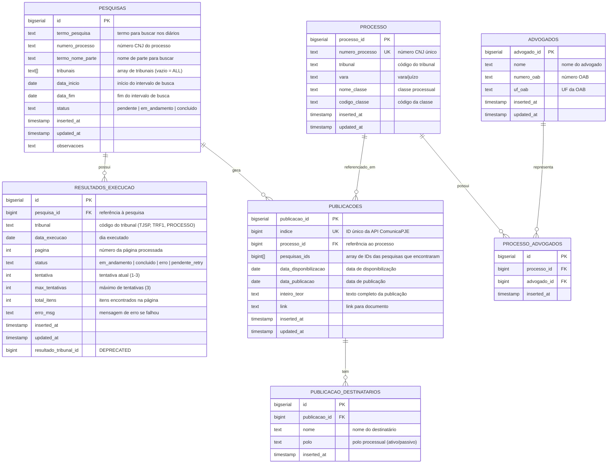

## 2. Fluxo de Estados da Pesquisa

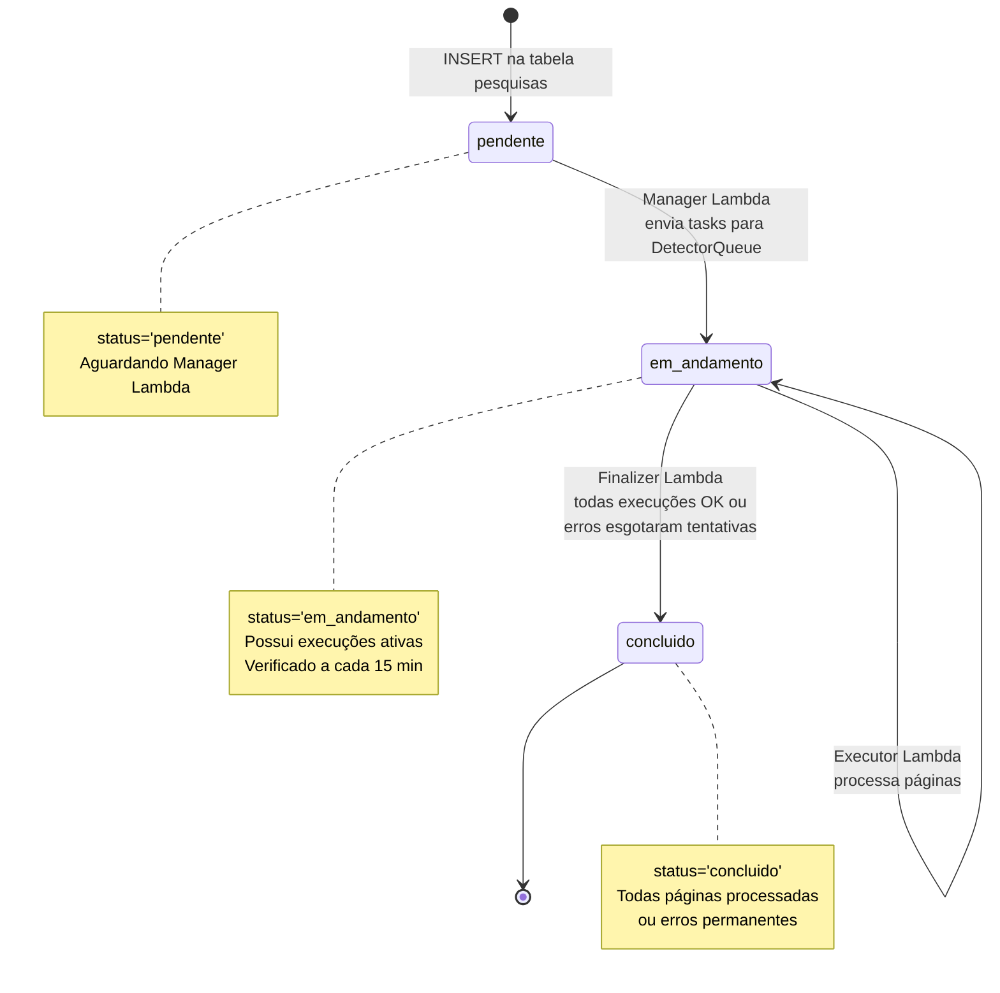

## 3. Fluxo de Estados da Execução (resultados_execucao)

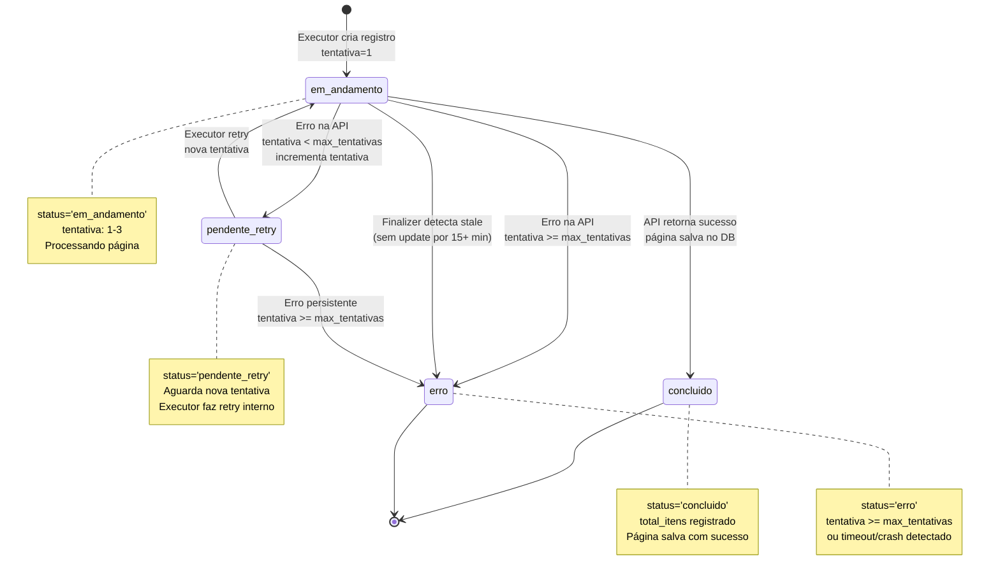

## 4. Fluxo Completo do Sistema

```mermaid
flowchart TD
    Start([Usuário insere pesquisa]) --> DB1[(diario.pesquisas<br/>status=pendente)]

    DB1 --> Manager[Manager Lambda<br/>Every 20 min]

    Manager --> Split{Tipo de<br/>pesquisa?}

    Split -->|numero_processo| NP[Sem split por tribunal<br/>Um task por período]
    Split -->|termo_pesquisa| TP[Split por tribunal<br/>Um task por dia+tribunal]

    NP --> DetectorQ[DetectorQueue SQS]
    TP --> DetectorQ

    Manager --> UpdateStatus1[(UPDATE pesquisas<br/>status=em_andamento)]

    DetectorQ --> Detector[PageBatchDetector Lambda<br/>Max 200 concurrent]

    Detector --> API1{API Call<br/>Page 1}

    API1 -->|totalElements=0| NoBatch[Retorna batches=empty<br/>Não envia ao Executor]
    API1 -->|pages <= 15| SingleBatch[Retorna task original<br/>1 batch]
    API1 -->|pages > 15| MultiBatch[Split em batches<br/>15 páginas cada]

    SingleBatch --> ExecutorQ[ExecutorQueue SQS]
    MultiBatch --> ExecutorQ

    ExecutorQ --> Executor[Executor Lambda<br/>Max 500 concurrent]

    Executor --> CreateExec[(INSERT resultados_execucao<br/>status=em_andamento<br/>tentativa=1)]

    CreateExec --> PageLoop{Para cada<br/>página}

    PageLoop --> APICall[API Call com retry<br/>max 3 tentativas]

    APICall -->|Sucesso| SaveResults[(UPSERT processo<br/>UPSERT publicacoes<br/>INSERT destinatarios)]

    SaveResults --> UpdateExecOK[(UPDATE resultados_execucao<br/>status=concluido<br/>total_itens=N)]

    UpdateExecOK --> HasMore{Tem mais<br/>páginas?}

    APICall -->|Erro tentativa < 3| Retry[(UPDATE resultados_execucao<br/>status=pendente_retry<br/>tentativa++)]

    Retry --> APICall

    APICall -->|Erro tentativa = 3| UpdateExecErr[(UPDATE resultados_execucao<br/>status=erro<br/>erro_msg)]

    UpdateExecErr --> HasMore

    HasMore -->|Sim| PageLoop
    HasMore -->|Não| End1([Fim da execução])

    End1 --> Finalizer[Finalizer Lambda<br/>Every 15 min]

    Finalizer --> CheckStale{Executações stale?<br/>sem update 15+ min}

    CheckStale -->|Sim| MarkStale[(UPDATE resultados_execucao<br/>status=erro<br/>erro_msg=timeout)]

    MarkStale --> CheckComplete
    CheckStale -->|Não| CheckComplete{Todas execuções<br/>concluído ou erro?}

    CheckComplete -->|Sim| MarkComplete[(UPDATE pesquisas<br/>status=concluido)]
    CheckComplete -->|Não| KeepRunning[(Mantém em_andamento<br/>tem pendências)]

    MarkComplete --> EndFlow([Pesquisa finalizada])
    KeepRunning --> WaitNext([Aguarda próximo<br/>Finalizer])

    style DB1 fill:#e1f5ff
    style UpdateStatus1 fill:#e1f5ff
    style CreateExec fill:#e1f5ff
    style SaveResults fill:#e1f5ff
    style UpdateExecOK fill:#e1f5ff
    style UpdateExecErr fill:#e1f5ff
    style Retry fill:#fff4e1
    style MarkStale fill:#ffe1e1
    style MarkComplete fill:#e1ffe1
```

## 5. Uso dos Campos de Controle

### 5.1. Tabela `diario.pesquisas`

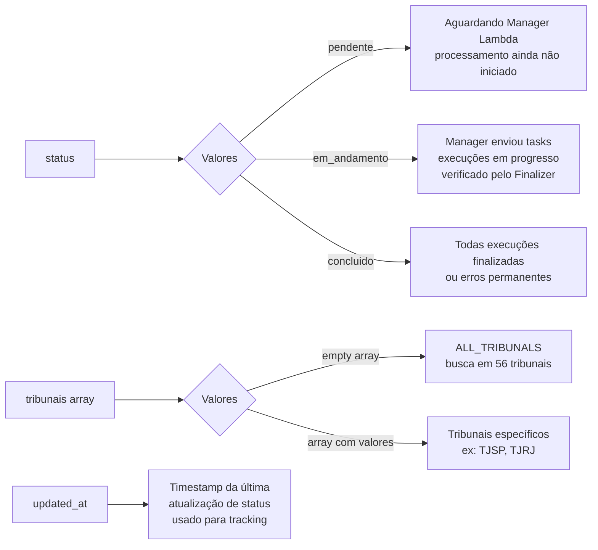

### 5.2. Tabela `diario.resultados_execucao`

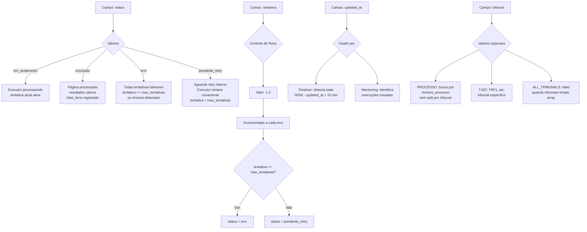

### 5.3. Campos de Controle de Paginação (task parameters)

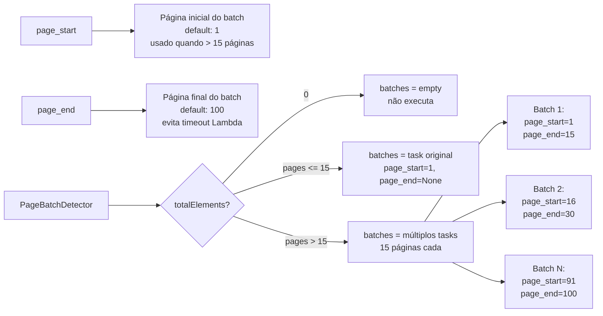

## 6. Padrões de Query Importantes

### 6.1. Verificar status de uma pesquisa

```sql
-- Resumo de execuções por status
SELECT
    status,
    COUNT(*) as count,
    SUM(total_itens) as total_items
FROM diario.resultados_execucao
WHERE pesquisa_id = :search_id
GROUP BY status;

-- Identificar execuções com problemas
SELECT
    tribunal,
    data_execucao,
    pagina,
    tentativa,
    erro_msg,
    EXTRACT(EPOCH FROM (NOW() - updated_at)) / 60 as minutes_since_update
FROM diario.resultados_execucao
WHERE pesquisa_id = :search_id
  AND status IN ('erro', 'em_andamento', 'pendente_retry')
ORDER BY tentativa DESC, updated_at DESC;
```

### 6.2. Detectar execuções stale (Finalizer)

```sql
-- Execuções travadas há mais de 15 minutos
SELECT
    id,
    tribunal,
    data_execucao,
    pagina,
    EXTRACT(EPOCH FROM (NOW() - updated_at)) / 60 as minutes_stale
FROM diario.resultados_execucao
WHERE pesquisa_id = :search_id
  AND status IN ('em_andamento', 'pendente_retry')
  AND updated_at < NOW() - INTERVAL '15 minutes';
```

### 6.3. Constraint único de execução

```sql
-- Constraint: unique_execucao_new
-- Garante uma execução por (pesquisa_id, tribunal, data_execucao, pagina)
-- Permite ON CONFLICT para upsert de execuções
UNIQUE (pesquisa_id, tribunal, data_execucao, pagina)
```

### 6.4. Upsert de publicações com pesquisas_ids

```sql
-- Adiciona pesquisa_id ao array se não existir
INSERT INTO diario.publicacoes
    (indice, pesquisas_ids, ...)
VALUES (:indice, ARRAY[:pesquisa_id]::BIGINT[], ...)
ON CONFLICT (indice) DO UPDATE SET
    pesquisas_ids = CASE
        WHEN :pesquisa_id = ANY(diario.publicacoes.pesquisas_ids)
        THEN diario.publicacoes.pesquisas_ids
        ELSE array_append(diario.publicacoes.pesquisas_ids, :pesquisa_id)
    END;
```

## 7. Características do Sistema de Controle

### 7.1. Retry Logic (3 tentativas)

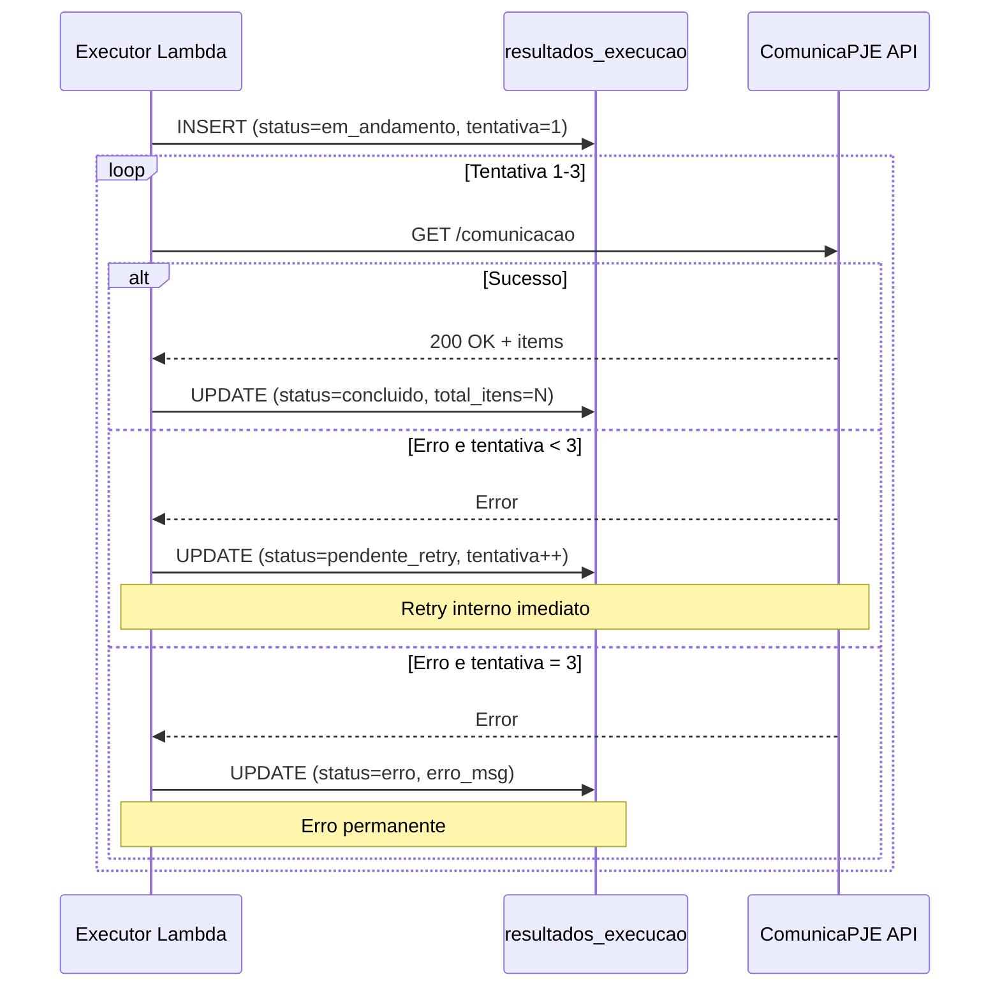

### 7.2. Stale Detection (Finalizer)

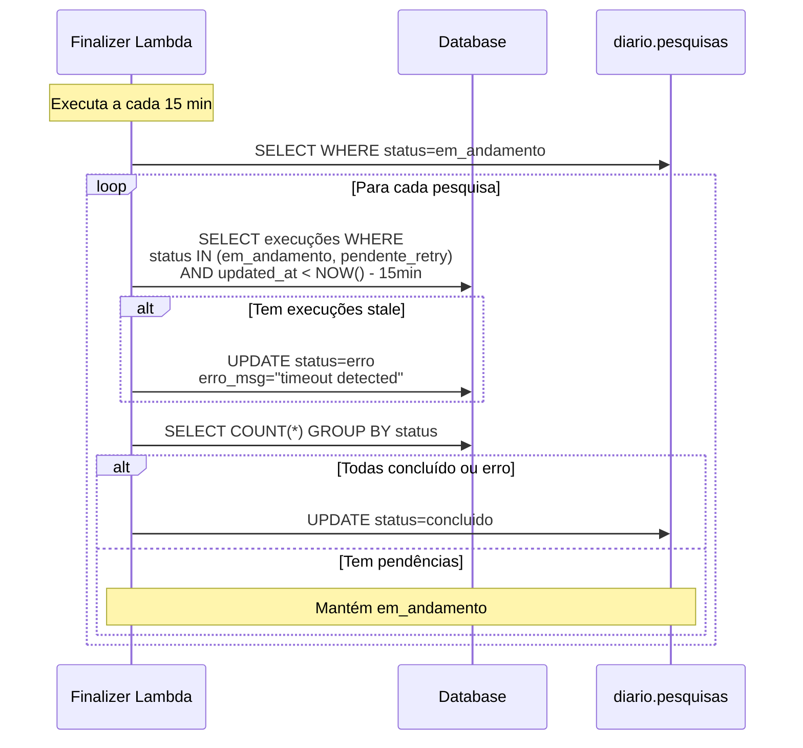

### 7.3. Rate Limiting via SQS

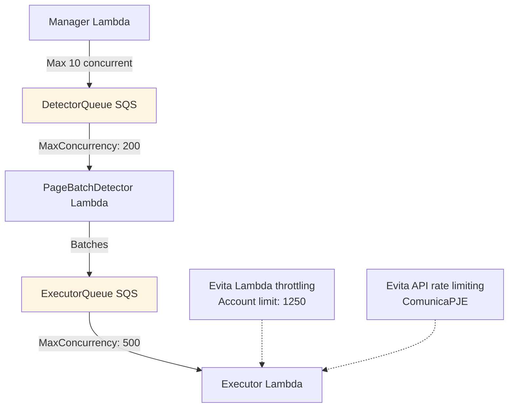

## 8. Exemplo de Execução Completa

### Cenário: Pesquisa ALL_TRIBUNALS por 1 mês

```mermaid
gantt
    title Timeline de Execução - Pesquisa 20151 (ALL_TRIBUNALS, 30 dias)
    dateFormat HH:mm
    axisFormat %H:%M

    section Manager
    Busca pesquisas pendentes    :00:00, 1m
    Split 56 tribunais x 30 dias  :00:01, 2m
    Envia 1680 tasks (DetectorQ)  :00:03, 5m
    UPDATE status=em_andamento    :00:08, 1m

    section Detector (200 concurrent)
    Processa tasks do DetectorQ   :00:09, 30m
    Chama API page 1 por task     :00:10, 29m
    Envia batches ao ExecutorQ    :00:15, 24m

    section Executor (500 concurrent)
    Processa batches do ExecutorQ :00:20, 120m
    Salva resultados página a página :00:25, 115m
    Cria/atualiza resultados_execucao :00:25, 115m

    section Finalizer
    1ª verificação (15 min)       :00:15, 1m
    Mantém em_andamento           :00:16, 1m
    2ª verificação (30 min)       :00:30, 1m
    Mantém em_andamento           :00:31, 1m
    3ª verificação (após Executor):02:25, 1m
    Marca concluido               :02:26, 1m
```

**Estatísticas do exemplo:**
- **Pesquisa:** termo_pesquisa="precatório", tribunais=[], 30 dias
- **Tasks gerados:** 56 tribunais × 30 dias = 1,680 tasks
- **Tempo total:** ~2.5 horas (processamento paralelo)
- **Execuções criadas:** 1,680 × média de 3 páginas/dia = ~5,000 execuções
- **Resultados:** ~50,000 publicações encontradas
