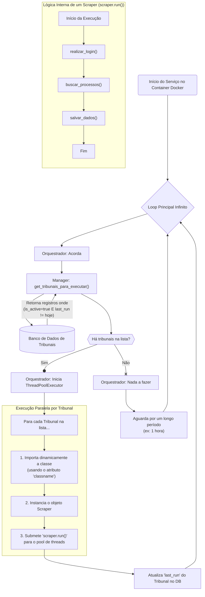

### Fluxograma da Arquitetura do Serviço de Scraping

```mermaid
graph TD
    A(Início do Serviço no Container Docker) --> B{Loop Principal Infinito};
    DB[(Banco de Dados de Tribunais)];

    B --> C[Orquestrador: Acorda];
    C --> D["Manager: get_tribunais_para_executar()"];
    D --> DB;
    DB --"Retorna registros onde<br/>(is_active=true E last_run != hoje)"--> D;
    D --> E{{Há tribunais na lista?}};

    E --o|Sim| F[Orquestrador: Inicia ThreadPoolExecutor];
    F --> G["Para cada Tribunal na lista..."];

    subgraph "Execução Paralela por Tribunal"
        direction LR
        G --> H["1. Importa dinamicamente a classe<br/>(usando o atributo 'classname')"];
        H --> I["2. Instancia o objeto Scraper"];
        I --> J["3. Submete 'scraper.run()' para o pool de threads"];
    end

    J --> K["Atualiza 'last_run' do Tribunal no DB"] --> B;

    subgraph "Lógica Interna de um Scraper (scraper.run())"
        direction TB
        L[Início da Execução] --> M["realizar_login()"];
        M --> N["buscar_processos()"];
        N --> O["salvar_dados()"];
        O --> P[Fim];
    end

    E --x|Não| Q[Orquestrador: Nada a fazer];
    Q --> R["Aguarda por um longo período<br/>(ex: 1 hora)"] --> B;
```
